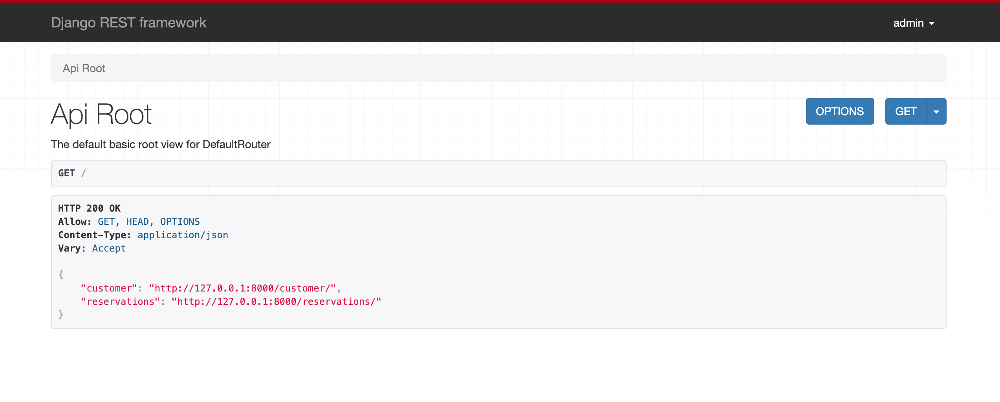
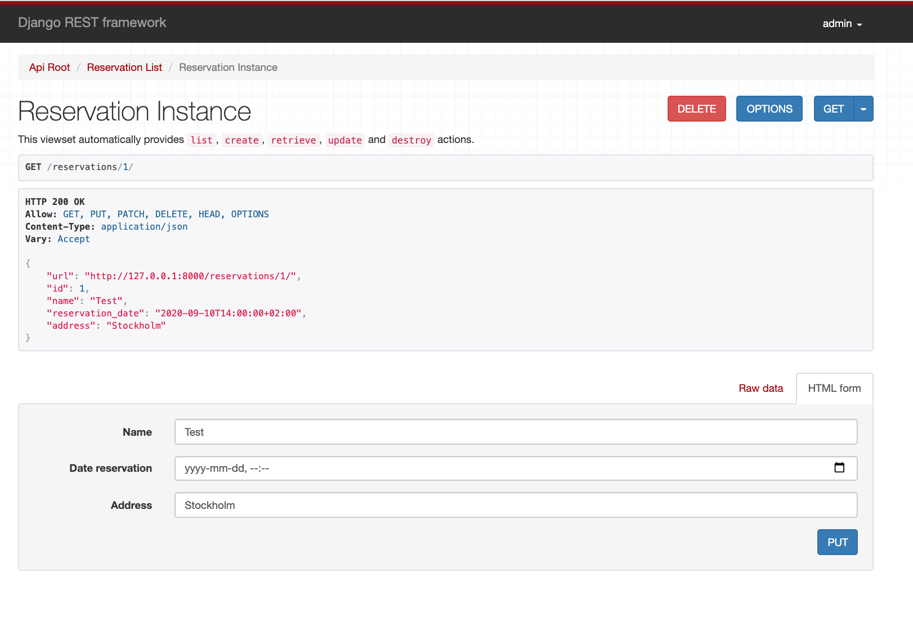

# Web-browsable Web API using Django and Django REST framework

The project builds a simple user database. There are two endpoints `/customer` and `/reservations` which allow Retrieve, List, Create, Update, and Delete a Customer or Reservation. <br />
The permission of Create, Update, and Delete is set for admin and staff. A normal user can only List and Retrieve on API.



### Development

Run the project within the project directory:

```
python manage.py runserver
```

The API can be opened in your browser at http://127.0.0.1:8000/, and we can view the list 'customer' and 'reservations' API. <br />
If you use the Login control in the top right corner you'll also be able to create, update, and delete a customer or reservation from the system.





### Test

The tests for the Create and List for a normal user and a staff:

```
python manage.py test
```
